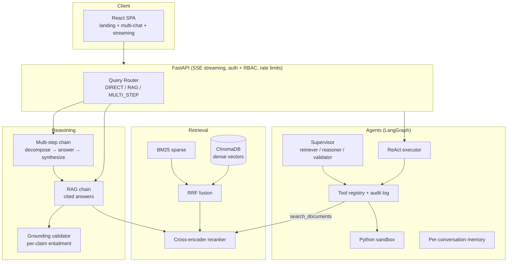

# AdaptiveRAG

**Drop in any documents. Chat with an LLM that understands them — with citations, multi-step reasoning, and autonomous agents.**

[](https://github.com/2407adi/adaptiveRAG/actions/workflows/ci.yaml)


AdaptiveRAG is a **completely domain-agnostic** RAG + Reasoning + Agents framework. There is no domain picker, no per-domain config, no custom tools per use case — the same code and the same three generic tools handle legal contracts, research papers, or financial reports. The LLM figures out the domain from the content itself.

**User flow:** open the app → sign in → drop files → wait ~30 seconds → chat with your docs.

**Live demo:** [adaptiverag.agreeablesmoke-25e3f551.centralindia.azurecontainerapps.io](https://adaptiverag.agreeablesmoke-25e3f551.centralindia.azurecontainerapps.io/)

> Hosted on **Azure Container Apps** with scale-to-zero — the app sleeps when idle (near-zero cost) and wakes on the first request, so give the initial load a few seconds. One container serves both the API and the React UI; the vector index, conversations, and audit log persist on an Azure Files volume across revisions. Every merge to main builds the image, pushes it to GHCR, and rolls a new revision automatically.

---

## Three capability layers

| Layer | What it does | How |
|---|---|---|
| **1. RAG** | Grounded Q&A with citations | Hybrid retrieval (dense + BM25 fused with RRF) → cross-encoder reranking → cited answer |
| **2. Reasoning** | Complex multi-step questions — compare, synthesize, analyze across documents | LLM router classifies each query (DIRECT / RAG / MULTI_STEP); multi-step chain decomposes → answers sub-questions → synthesizes |
| **3. Agents** | Autonomous multi-step workflows | LangGraph ReAct executor with exactly **3 generic tools**: `search_documents`, `run_python` (sandboxed), `web_search` — plus an optional multi-agent supervisor mode |

Every layer is independently togglable from config, which enables ablation benchmarking (prove each layer pays rent).

## Highlights

- **Hybrid retrieval + reranking** — dense vectors (ChromaDB/FAISS) and BM25 fused via Reciprocal Rank Fusion, then a cross-encoder (`ms-marco-MiniLM-L-6-v2`) re-scores a wide top-20 fetch down to a precise top-5. Cohere Rerank as optional backend.
- **Hallucination detection** — a `GroundingValidator` decomposes every answer into atomic claims and runs LLM-as-judge entailment per claim against the retrieved sources. The UI shows a grounding badge with per-claim SUPPORTED / UNSUPPORTED / CONTRADICTED verdicts.
- **Human-in-the-loop agents** — side-effecting tools (`run_python`, `web_search`) freeze the LangGraph state machine via `interrupt()` and wait for user approval over HTTP; denial with a reason resumes the same run.
- **Multi-agent supervisor** — a supervisor delegates to retriever / reasoner / validator workers built as LangGraph subgraphs. All workers share the same tool registry and differ only by system prompt.
- **Secure code execution** — `run_python` runs in a spawned child process with restricted builtins, a module whitelist, and OS resource limits (CPU, memory, wall-clock timeout).
- **Tamper-evident audit log** — every tool call is written to an append-only, HMAC-chained JSONL log; `verify()` detects any modified or forged entry.
- **Evaluation suite with a CI regression gate** — four RAGAS-style metrics (faithfulness, answer relevancy, context recall, context precision) plus router accuracy, implemented from scratch, run against a hermetic 25-sample dataset with deliberate traps (cross-document contradictions, silent gaps, negation tests). Scheduled CI runs compare against a committed baseline with per-metric thresholds and fail on regressions.
- **Production service layer** — FastAPI with token streaming on all paths (RAG, multi-step, agent, supervisor) over a typed SSE protocol; API-key auth with RBAC (admin/user), rate limiting, and upload/store caps; chat-scoped ingestion (documents uploaded in a chat are retrievable only by that chat); SQLite conversation persistence with per-conversation agent memory.
- **One container, zero manual deploys** — multi-stage Docker build (React SPA compiled in a node stage, served as static files by FastAPI); GitHub Actions runs lint + ~250 offline tests on every PR, and merges to main build and push to GHCR, then deploy to Azure Container Apps.

## Architecture



Ingestion supports 7 document formats (PDF with OCR fallback, DOCX, HTML, CSV, and more), 3 chunking strategies, and 2 embedding backends. Every chunk is stamped with a scope (`shared` or `chat:<id>`) at ingest time, and retrieval filters by scope across all backends.

## Tech stack

Python 3.11 · LangChain / LangGraph · ChromaDB + FAISS · sentence-transformers · Azure OpenAI (GPT-4o) · FastAPI · React + TypeScript + Vite + Tailwind · SQLite · Docker · GitHub Actions · Azure Container Apps

## Repository layout

```
src/adaptiverag/
├── ingest/       # loaders (7 formats), chunkers, embedders, ingest pipeline
├── retrieve/     # vector stores, BM25, hybrid RRF fusion, reranker, query expansion
├── reason/       # query router, RAG + multi-step chains, grounding validator
├── agents/       # ReAct executor, supervisor, tool registry, sandbox, audit log, memory
├── api/          # FastAPI app, routes, SSE, auth/RBAC, conversation store
├── eval/         # metrics, eval suite, baseline regression gate
└── pipeline.py   # wire_pipeline() — single factory wiring the whole stack
web/              # React SPA (production UI, served by FastAPI)
ui/               # Streamlit harness (local dev only)
config/           # default.yaml — every dial is config-driven, no hardcoded behavior
tests/            # ~250 offline tests (mocked LLMs — no API keys needed)
.github/workflows # ci.yaml (PR gate) · deploy.yaml (GHCR + ACA) · eval.yaml (scheduled evals)
```

## Getting started

### Docker (recommended)

```bash
cp .env.example .env      # add your Azure OpenAI / OpenAI keys
docker compose up --build
# → http://localhost:8000
```

One image serves the API and the built web UI. The `./data` volume persists the vector index, conversations, models, and audit log across rebuilds.

### Local development

```bash
# system deps (for PDF OCR): tesseract-ocr, poppler-utils
pip install -e ".[dev]"
cp .env.example .env

uvicorn adaptiverag.api.main:app --reload   # API on :8000
streamlit run ui/app.py                     # or: Streamlit dev harness
cd web && npm install && npm run dev        # frontend dev server (proxies to :8000)
```

Secrets live in `.env` (never in YAML): Azure OpenAI credentials, `ADAPTIVERAG_API_KEYS="<key>:admin,<key>:user"`, `AUDIT_HMAC_KEY`, optional `TAVILY_API_KEY`. Set `auth.enabled: false` in `config/default.yaml` to skip the key gate locally.

### Run the tests and evals

```bash
pytest -q                            # ~250 offline tests, no API keys needed
python -m adaptiverag.eval.suite     # live eval run (uses your LLM keys)
python -m adaptiverag.eval.compare   # gate the run against eval_results/baseline.json
```

## API overview

| Endpoint | Purpose |
|---|---|
| `GET /health` | Liveness probe (unauthenticated) |
| `POST /query` | One-shot query with server-side routing |
| `POST /chat/stream` | SSE chat: `route` → `sources` → `token`s → `grounding` → `done` |
| `POST /ingest` | Multipart upload (admin only; size + store caps) |
| `GET /conversations`, `GET /conversations/{id}` | Conversation history |
| `POST /agent/start\|resume` (+ `/stream`) | Agent runs with approval round-trips |

The typed SSE protocol streams tokens on every path and carries agent thoughts, tool traces, approval requests, supervisor handoffs, and per-worker reports as distinct event types.

## Roadmap

MCP server exposing the tool registry · local LLM backend with prompt-based ReAct · public ablation benchmark (HotpotQA / Natural Questions) across the config ladder · multi-domain demo · knowledge-graph memory layer.

---

Built as a hands-on GenAI engineering capstone — every layer implemented from first principles (routing, grounding, eval metrics, sandboxing, and the agent loop are hand-built, not off-the-shelf chains).
